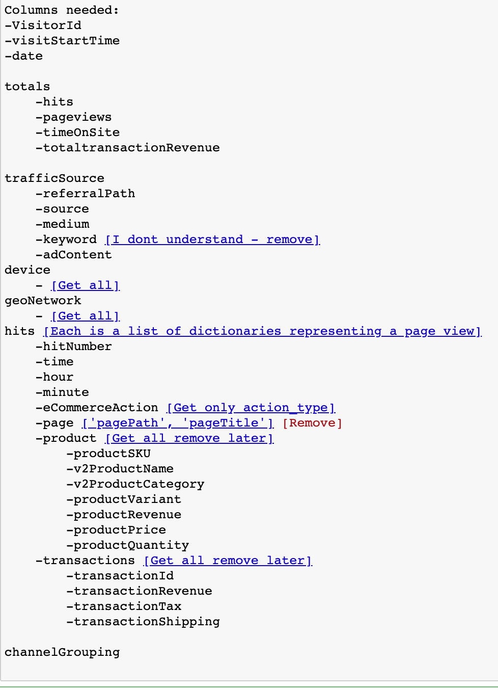
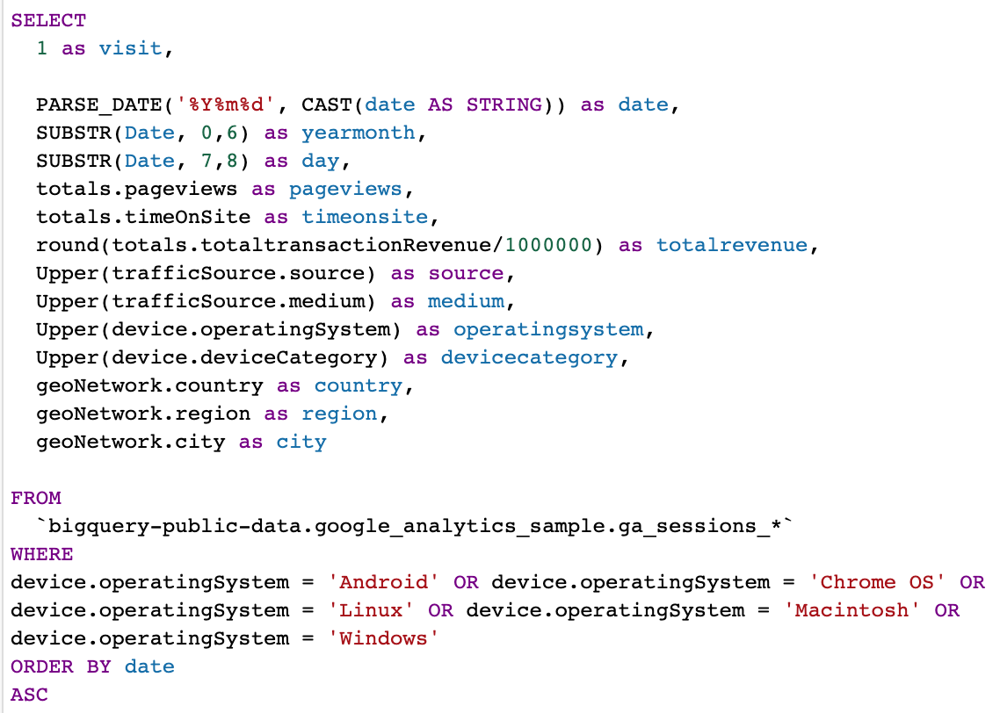
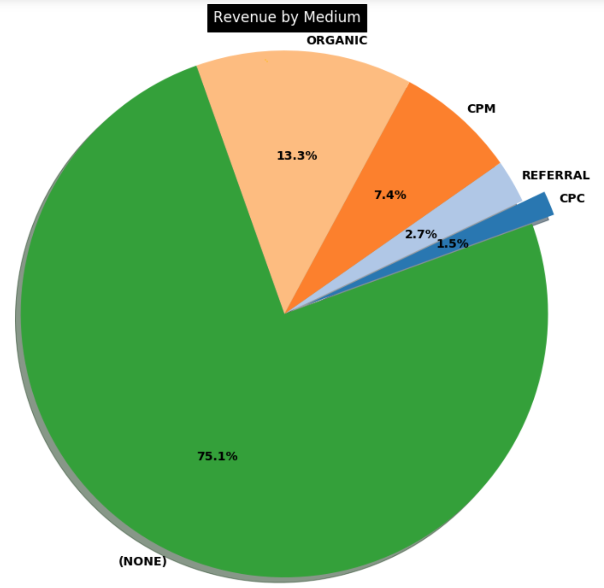
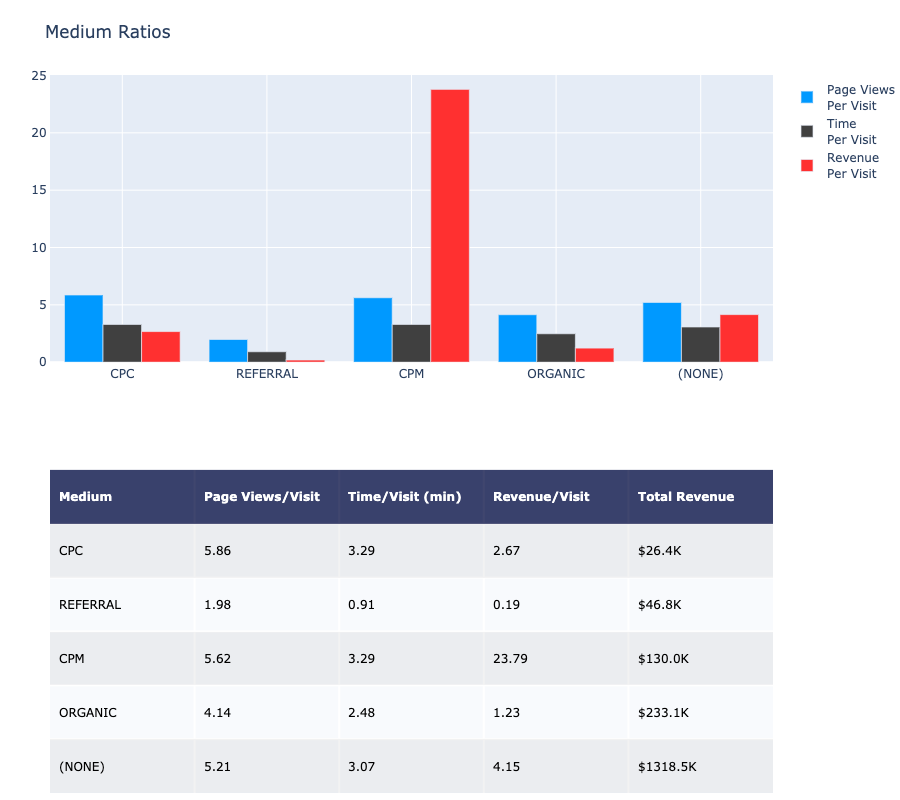
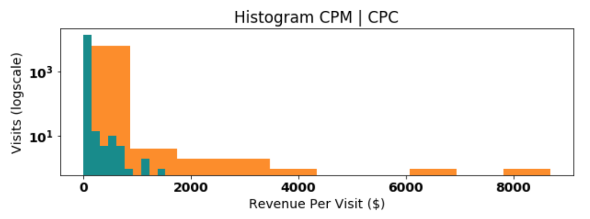
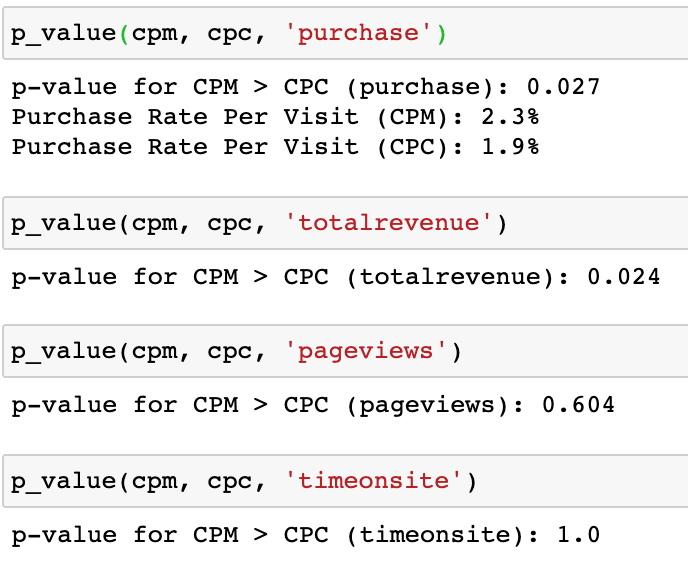

# Google Analytics Ecommerce
Google Merchandise Store (2016 - 2017)

> Project Goals:
- Data clean and explore Google Merchandise Store data from (2016-2017)
- Obtain insights and present visualizations of data.
- Validate insights using statical testing.
---

### Table of Contents
- [Description](#description)
- [Data Understanding](#data-understanding)
- [Data Preparation & Models](#data-preparation)
- [Hypothesis Testing](#hypothesis-testing)
- [Author-Info](#author-info)

---

## Description

The primary business model of ecommerce stores is to increase web-traffic to their site. This is usually done organically through branding and marketing campaigns. Additionally, Ecommerce stores purchase ad space on other publisher sites in order to drive web-traffic to their ecommerce store. Ad space involves a bidding system among competing sites and therefore price varies.

There are two main pricing models for purchasing ad space: CPC (Cost Per Click) and CPM (Cost Per Thousand Impressions). Under a CPC model, publishers are paid by number of ad clicks regardless of how many times that particular ad was shown. Under a CPM model, publishers are paid by the number of times the ad was shown (per thousand).

This project will explore the sample data from Google Merchandise Store between September 2016 to September 2017. The primary objective is to determine which business model (CPC or CPM) is superior and whether increased advertising spending would be immediately accretive to cashflow. A secondary objective would be to demonstrate the power of Google BigQuery in terms of analyizing big data.

[Back To The Top](#Google-Analytics-Ecommerce)

---

## Data Understanding

The data sample consisted of 366 tables each representing a day of web-traffic. In total the dataset contained 903,653 rows of data. The issue was that the dataset housed many nested dictionaries with data ranging from device information to nested dictionaries representing web-page data per visitor click. This created a heavy strain on memory as each table would be over 100mb (40GB total). The first step would be to figure out which dictionaries/keys to keep and create a script to extract embedded dictionaries into a larger dataframe. There were over 200 columns, many consisting of nested dictionaries within nested dictionaries. In order to lower disk usage I combed through the [BigQuery Export schema](https://support.google.com/analytics/answer/3437719?hl=en) and created a schema map to be used in a script to extract specific values.

[Back To The Top](#Google-Analytics-Ecommerce)

---

## Data Preparation

After installing the neccessary imports to connect to Google BigQuery and authenticate, I created a date script to build a list that will be used to call all 366 tables. I designed another script to pull a single table from Google BigQuery, convert its string representations of dictionaries into an actual dictionary using ast.literal_eval. The data would then run through another function that would run through each of the 200 columns and only extract the values and dictionaries listed in the schema. Each clean table will be appended into a dataframe and, once completed, all 903,653 rows will be saved into a json file. I used tqdm to create a progress bar for the download. In total the download took 3 hours.

I originally wanted to utilize Docker and Spark to parse the nested dictionaries but quickly ran into memory issues. Another function was built to read the json and parse out the nested dictionaries as individual columns. There were additional nested dictionaries within a dictionary so the function had to be modified to compensate. After successfully converting a sample size of 1500 rows from json into a pandas dataframe the function was run on the full 903,653 rows. However, the tqdm progress bar indicated the entire conversion would take 14 hours.

I decided to use Google BigQuery directly to process the data instead my local machine which could not handle the data load. Google BigQuery was simple, fast, and flexible. I easily translated my previous cleaning scripts into simple SQL that accomplished the same outcome. I exported the data into a csv which naturally turns the nested dictionaries into pandas columns.

When the data was load I created 5 functions to automate clean and plotting the data based on column inputs.

- Barchart (Exploring overall data)
- Piechart (Exploring % of categories)
- Time Series (Exploring data through time)
- Table (Measure ratios of grouped data)
- Table and Barchart (Further Analysis of data)

 

 
[Back To The Top](#Google-Analytics-Ecommerce)

CPM makes up for 7.4% of total revenue while CPC only 1.5%. However, there is a significant difference in revenue per visit between CPM and CPC. We will explore that further in the next section and run a number of hypothesis tests.

---

## Hypothesis Testing

CPC vs CPM
P-Value = 5%

Null Hypothesis:
1. The purchase rate/visit of CPC and CPM come from the same distribution.
2. The revenue/visit of CPC and CPM come from the same distribution.
3. The page views/visit of CPC and CPM come from the same distribution.
4. The time spent/visit of CPC and CPM come from the same distribution.

Alternative:
1. The purchase rate/visit of CPC and CPM come from different distributions.
2. The revenue/visit/visit of CPC and CPM come from different distributions.
3. The page views/visit of CPC and CPM come from different distributions.
4. The time spent/visit of CPC and CPM come from different distributions.

A histogram of purchase amounts per visitor is below.

CPC had 13,079 visits and 242 purchases. CPM had 6,184 visits and 140 purchases. Since the data from the histogram is not normally distributed, I decided to use the Mann-Whitney U-test.

The results from our Mann-Whitney U-test returned a p-value of 0.027 and 0.024 for purchase/visit rate and revenue/visit respectively. This is below our p-value threshold of 5% so we can reject the null and accept the alternative hypothesis that CPM is better than CPC advertising.

The p-values for pageviews/visit and time spent/visit were far larger than 5% so we can accept the null.

However, the variances of the data are quite large so I ran the Welsh T-Test with equal variance being False:

The p-value for purchase rate is .064 which is above the alpha threshold so we cannot reject the null. However, for average revenue per visit our p-value was .046 which is below our alpha threshold so we can reject the null. This does not necessarily indicate that CPM is more accretive than CPC because we do not know the price the Google Merchanise Store paid for their CPM and CPC ad campaigns. We can, however, use the average revenue per visit metric to help bid on CPM and CPC ad traffic in the future.

[Back To The Top](#Google-Analytics-Ecommerce)

---

## Author Info

- LinkedIn - [clifford-cheng](https://www.linkedin.com/in/clifford-cheng/)
- Email - cliffpcheng@gmail.com
- Link to Presentation - Google Slides(https://docs.google.com/presentation/d/1hmPWkk8wQeU-I1R2UWYbF2AE2LGmVv5vj5d2Z5rZG5g/edit?usp=sharing)

[Back To The Top](#Google-Analytics-Ecommerce)
